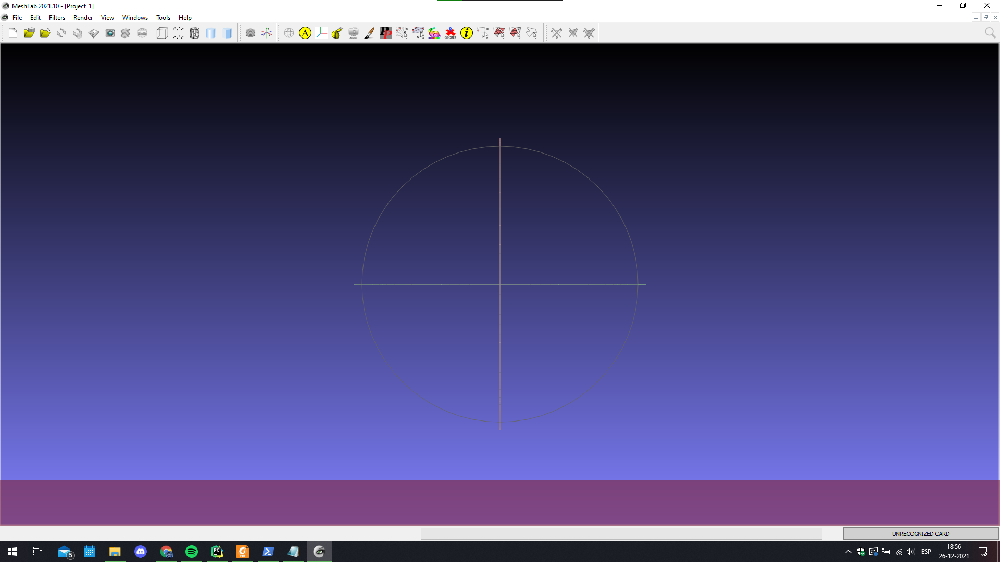
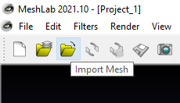
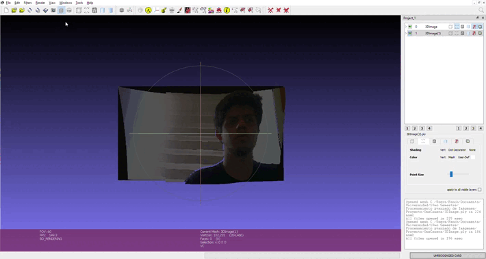

# Reconstrucción de Escenas 3D Utilizando Visión Estéreo

Este proyecto se busca implementar un sistema de reconstrucción de escenas 3D a partir de imágenes obtenidas de una configuración estéreo.
Los principales hitos que se deben alcanzar en el proyecto son los siguientes:

1. Construcción de una cámara estéreo
2. Calibración intrínseca y extrínseca de cámara estero
3. Eliminación de distorsión
4. Generación de mapa de disparidad
5. Reproyección de puntos
6. Construcción de una nube de puntos

Actualmente el proyecto funciona utilizando **sólo una cámara**, sin embargo se está trabajando en una implementación para dos cámaras.

Para visualizar la nube de puntos generada se recomienda utilizar el programa [MeshLab](https://www.meshlab.net/#download), como se muestra a continuación:

## Una cámara

El código relevante para estimar la profunidad de imágenes usando una sola cámara se encuentra dentro de la carpeta **OneCamera**, el orden en el que se deben correr los scripts es:

> capture.py > 1CameraCalibration.py > disparityMap.py > reconstruction.py

A continuación se describen las funciones de cada uno de los scripts:

### capture.py

Capturar las imágenes que serán utilizadas en la calibración de la cámara estéreo y guardarlas en *OneCamera/images/*.
Tiene sólo una función *capture*, que recibe la resolución con la que se quiere utilizar la cámara *width* y *height* (se usa 1280 y 720 en este caso). 

Las siguientes funciones se encuentran disponibles en la ventana de captura:

- ESC: Cerrar la ventana y detener el script
- d: Borrar todas las imágenes dentro de la carpeta *OneCamera/images/*
- s: Capturar una imagen

### 1CameraCalibration.py

Computar los parámetros correspondientes a la calibración intrínseca y extrínseca de la cámara (ret, CM, dist, rvecs, tvecs), utilizando las imágenes almacenadas en *OneCamera/images/*.
La función *getPoints* se encarga de ubicar los vértices de los cuadros del tablero de ajedrez, debe recibir el tamaño del tablero de ajedrez *boardSize* ((9,6) en este caso) y un flag que indica si se muestran o no los vérticas detectados *verbose*.
La función *calibrate* se encarga de computar los parámetros ya mencionados, mediante el método *cv2.calibrateCamera*.
Una vez encontrados los bordes y calculados los parámetros, estos se almacenan como arrays de numpy en la ruta *OneCamera/params*, finalmente se muestra en pantalla el error de re-proyección resultante de la calibración.

### disparityMap.py

Captura las imágenes libres de distorsión y computa el mapa de disparidad asociado a la imagen de la izquierda.
La función *unDistortedCapture* es análoga a *capture* del script *capture.py*, pero en esta se remueve la distorsión y sólo se permite capturar dos imágenes.
La función *computeDisparity* se encarga de calcular el mapa de disparidad, se recomienda usar *numDisparity=128*, tiene dos modos:

1. BM	-> Calcula la disparidad usando **Block Matching**, se recomienda *winSize=3*
2. SGBM	-> Calcula la disparidad usando **Semi-Global Block Matching**, se recomienda *winSize=11*

También puede aplicar el filtro de **Weighted Least Squares** para mejorar los mapas de disparidad generados.

La función *resize* reduce el tamaño de una imagen *img* en un factor *downRatio*, existe simplemente para que el código sea más legible.

El mapa de disparidad generado se almacena como un array de numpy en la ruta *OneCamera/params/disparityMap"

### reconstruction.py

Se encarga de generar la nube de puntos y aplicarla sobre la imagen izquierda, generando el archivo "OneCamera/3DImage.ply", el cual debe ser importado en **MeshLab** para poder ser visualizado.
